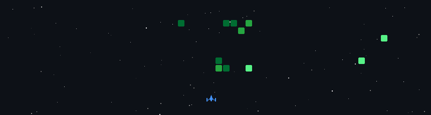

 

 

 

 

 

### 🚀 Contribution Space Shooter

> The GIF below is generated automatically from the GitHub contribution graph.

 

---

Built with SVG + GitHub Actions · no paid README service required.

